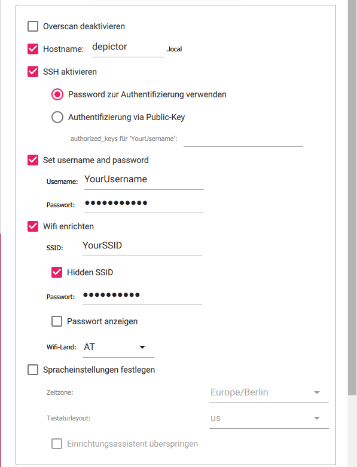

<p align="center">
  
</p>

# Depictor


Depictor is a web app that runs on a Raspberry Pi. It provides a simple and clean web interface to easily generate and draw images on an 2d plotter.
It features automatic background removal, custom gcode settings, print time estimates, gallery with previous prints and many more features. It is currently optimized for GRBL plotter, but the basic feautres should work with most plotter.

The image conversion is based on the [Drawbot_image_to_gcode_v2](https://github.com/Scott-Cooper/Drawbot_image_to_gcode_v2) project.

# Table of contents

   * [Features](#features)
   * [Demo](#demo)
   * [Screenshots](#screenshots)
   * [Installation & Setup](#Installation-&-Setup)
     * [Material](#material)
     * [Quick install instructions](#quick-install-instructions)
     * [Detailed install instructions](#detailed-install-instructions)
     * [Setup](#setup)
       * [Start gcode](#start-gcode)
       * [Gcode scaling](#gcode-scaling)
       * [Start gcode](#start-gcode)
       * [Pen down command](#pen-down-command)
       * [Enable automatic background removal](#enable-automatic-background-removal)
   * [Supported Raspberry Pi models ](#supported-raspberry-pi-models)
   * [Acknowledgements](#acknowledgements)
   * [License](#license)
   * [Run Locally](#run-locally)
   * [Support](#support)

# Features


- Modern and responsive web interface
- Image to gcode converter
- Automatic background removal
- Gallery with all previous drawings
- Live print progress view with time estimates
- One click updates


# Demo

[](https://www.youtube.com/watch?v=6MJPgy_1h4w)


# Screenshots


# Installation & Setup
I couldn't test this guide with a lot of people, so if something isn't clear or doesn't work, please create a new Issue or write an email to juliushussl@gmail.com.

## Material
- Raspberry pi
- min. 4GB micro sd card
- plotter that works with grbl (other non grbl plotter should also work in theory if they support the standard gcode set)
- a cable to connect the plotter and rpi over usb

## Quick install instructions:
If you are already familiar with rpis these are the simplified quick install instructions:
- install a raspbian os light image on the rpi.
- ssh into the rpi.
- execute these three commands:
```bash
  wget https://raw.githubusercontent.com/Iqwertz/Depictor/main/install.sh
  sudo chmod +x install.sh
  sudo ./install.sh
```
- Connect the plotter with the rpi via USB.
- Open a browser and enter the ip of your rpi in the browser to access the web interface. If everything was successful you should see the Depictor landing page! 
- (Before you start your first drawing you should check out the 'Setup' section)

## Detailed install instructions:
If you don't have any experience with Raspberry Pi's or have struggles to install Depictor with the quick install instructions, this is a step-by-step guide on how to install it:

### Insalling raspbian
To install raspbian on an sd card I recommend using the Raspberry Pi imager. You can download it here: [www.raspberrypi.com/software/](https://www.raspberrypi.com/software/).
After installing Raspberry Pi imager and opening it up choose Raspberry Pi OS Lite (32-bit) as the os. Then select the correct sd-card and set the following settings (of course you have to change the username and password and set the correct wifi credentials):
<p align="center">
  
</p>
(The settings are in german and I cant find  way to change that but I think it is clear which settings should be used)

Then click on write and wait.
After the imager finished the write process remove the micro-sd card and put it into the rpi. You successfully created a raspbian image!

### Installing Depictor
To install Depictor on your rpi you have to ssh into it. 
To do so open a terminal and type in _ssh pi@depictor.local_ (if you changed your username replace _pi_ with your username).
There may be some warning... just accept it by typing _yes_ and then enter your password.
If every thing was successful the last line in the terminal should be: _pi@depictor:~ $_
Now paste these three commands: 
```bash
  wget https://raw.githubusercontent.com/Iqwertz/Depictor/main/install.sh
  sudo chmod +x install.sh
  sudo ./install.sh
```
(Or use this one liner:)
```bash
  wget https://raw.githubusercontent.com/Iqwertz/Depictor/main/install.sh && sudo chmod +x install.sh && sudo ./install.sh
```

The installation will take a few minutes. After it finished you successfully have installed Depictor! You can access it by opening this url in the browser: [depictor.local](http://depictor.local/).

## Setup
Before you try to draw your first image, you probably have to adjust these three settings (all of them can be found in the settings tab in the top right):

### **Start gcode**
In this text field you can paste some gcode that gets appended to the gcode file before drawing it. Before starting your first print please adjust the feedrate (default: 4000) and the homing command (default: $H) for your plotter. 

### **Gcode scaling**
Depictor will automatically scale your gcode to the size of your drawing area. By default, the drawing area is from [X0 Y0] to [X20 Y162]. Since these values are probably different on your machine you will have to adjust them:

- Gcode scaling:
  - To calculate this value move the pen to the corner of your drawing area that is the furthest away from 0,0. Enter these values in the settings under "Gcode scaling"
- Gcode offset:
  - To calculate this value move the pen to the corner of your drawing area that is closest to 0,0. Enter these values in the settings under "Gcode offset".

### **Pen down command** / **Pen up command**
Here you can configure the commands to lift and lower the drawing pen. If these commands are different on your plotter please change them here.

### **Enable automatic background removal**
The background remove function uses the [remove.bg](https://www.remove.bg/) api. To enable it you have to get an API key:
- Register on [remove.bg](https://www.remove.bg/)
- Go to the api settings: https://www.remove.bg/de/dashboard#api-key
- Click on "Show API key".
- Copy the key and paste it in the settings of Depictor under "_BgRemove API key_"

(Note: When using the free version of the api you can only convert 50 pictures a month. If you need more you can buy more on the [remove.bg](https://www.remove.bg/) website)
 

# Supported Raspberry Pi models 
The project was developed and tested with a Raspberry Pi 3B but should work on every official model. However, it is not recommended to use a Raspberry Pi zero due to its limited processing power (the image conversion will take 15+ min).
    
# Acknowledgements

 - Huge thanks to [Scott-Cooper](https://github.com/Scott-Cooper), for creating the  [Drawbot_image_to_gcode_v2](https://github.com/Scott-Cooper/Drawbot_image_to_gcode_v2) which is used to convert the images to beautiful gcode.
 - [gcode-cli](https://github.com/hzeller)
 - [remove.bg](https://www.remove.bg/de)


# License

[GPL-3.0 License](https://choosealicense.com/licenses/gpl-3.0/)


# Run Locally

Clone the project

```bash
  git clone https://github.com/Iqwertz/Depictor.git
```

## Start the backend server
Go to the projects backend directory:

```bash
  cd Depictor/Backend
```

Install backend dependencies :

```bash
  npm i
```

Start the backend server:

```bash
  npm run start
```
or
```bash
  nodemon
```

## Serve frontend
Go to the projects frontend directory:

```bash
  cd Depictor/Frontend
```

Install frontend dependencies:

```bash
  npm i
```

Start frontend live server:

```bash
  ng serve
```


## Deployment

To generate a new release run

```bash
  ./ generateRelease.sh
```


# Support

For support, email juliushussl@gmail.com .

